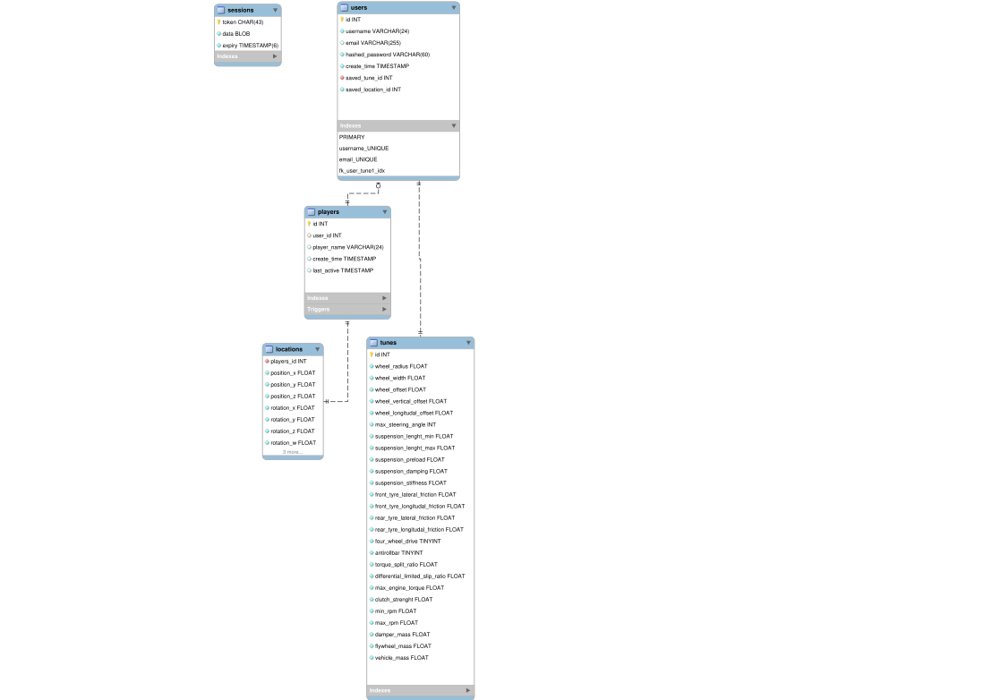

# Käyttöönotto
Tietokannan käyttöönotto vaatii .env tiedoston, josta docker asettaa parametrit tietokannalle.
## Esimerkki .env tiedosto
``` .env
CONTAINER_NAME=fullstack-project
DB_PORT=3306

MARIADB_ROOT_PASSWORD=salasana
MARIADB_DATABASE=fullstack_project
MARIADB_USER=client
MARIADB_PASSWORD=pass
```
## Tietokannan käynnistys
Tietokanta voidaan käynnistää seuraavalla komennolla.
``` bash
docker-compose up -d
```
### Database diagram

